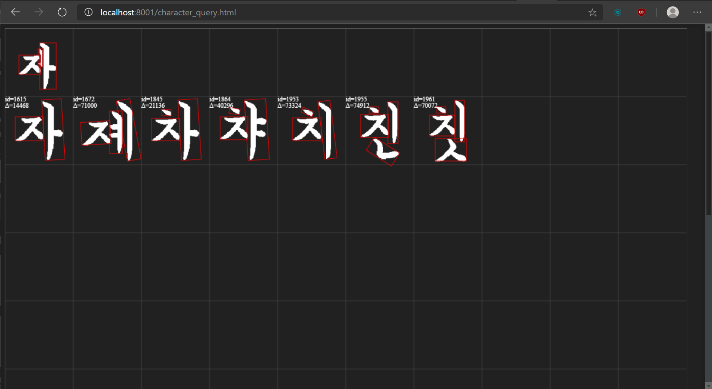
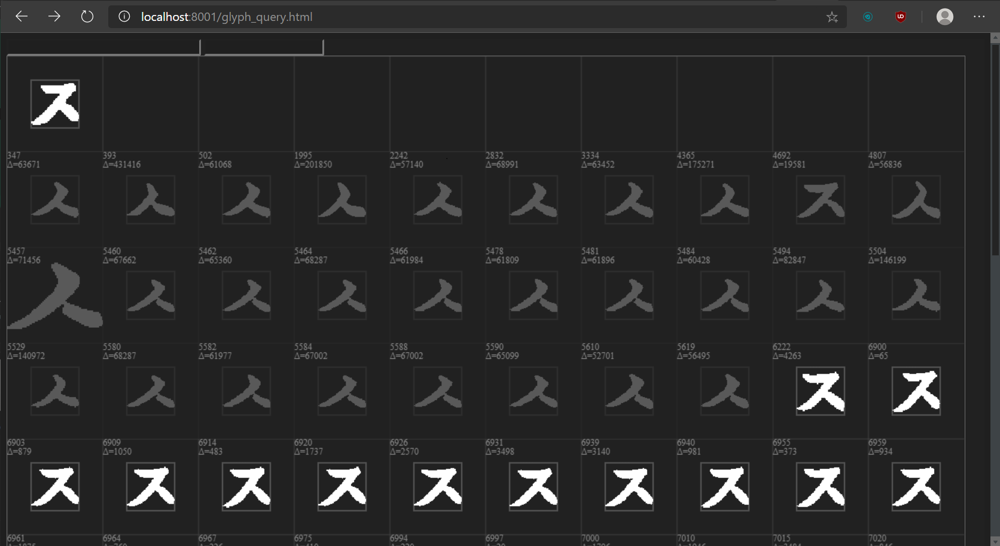
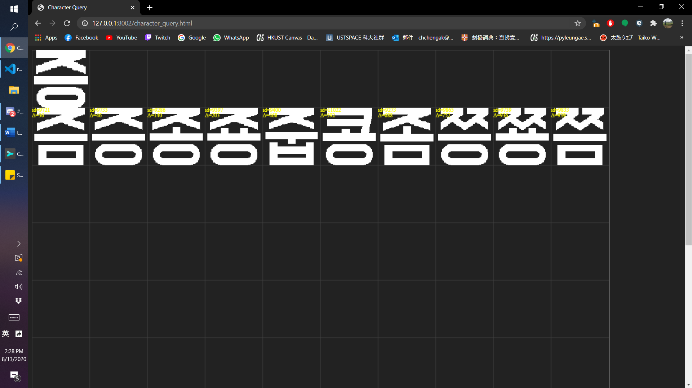

# ShapeCode - Shape Encoding and Symbolic Recognition

> This is unpublished research, I have been procrastinating for several years. It will probably never be published, but at least can serve as a memoir

Basically we developed and experimented with a shape encoding algorithm that has very interesting properties:

+ lossless encode-decode roundtrip
+ translation / scale invariant
+ rotational invariant under a normalization scheme
+ *the similarity of two symbols is a linear function of the weighted Hamming distance between the two encoded bitstrings*

The algorithm is particularly effective in searching for a symbol (query) from a database of symbols, and the experimental results on Chinese / Korean OCR shown great results. It can definitely be generalized to more complex graphics, i.e. colored signages.

The idea of the algorithm is simple - it falls under the statistical shape analysis family, basically denoting the mass of the shape as fraction of the occupancy of space, and shuffling the bits by their contribution to entropy - more significant bits come first.

Another interesting property is that you can basically truncate the bit string arbitrarily (okay there are dedicated splice points) and still retain some resemblance to the original shape. In other words, fidelity is directly proportional to the length of the bit string. In another words, you can roughly control how much entropy a given symbol occupy.

SymCode is a heavily simplified version of ShapeCode, retaining the essence of its philosophy and architecture. Since the reception of SymCode is pretty bad, so - 

The limitation of the algorithm is that it is not invariant under non-affine transform. In my opinion handling degeneration is out of the scope of this algorithm.

## Examples

## TODO
